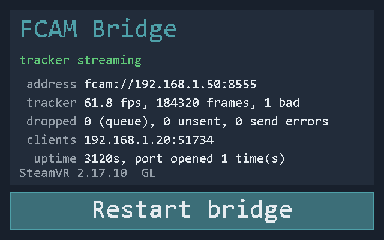

# Babble Bridge for the Steam Frame

Use a Babble face tracker that is plugged into a **Steam Frame** with
[Baballonia](https://github.com/Project-Babble/Baballonia), the Babble app, running on your PC.

```
Babble tracker ──USB-C (CDC-ACM)──> Steam Frame ──Wi-Fi (FCAM/UDP)──> PC: Baballonia
                                    fcam_bridge.py                    fcam://<headset-ip>:8555
```

The Frame's rear USB-C port powers the tracker and enumerates it, but the stock
kernel has no serial class driver and Baballonia does not run on the headset. The
bridge reads the tracker's JPEG stream from `/dev/ttyACM0` and sends it to the
PC over UDP with the small FCAM protocol described in [PROTOCOL.md](PROTOCOL.md).
On the PC, Baballonia's **FCAM UDP Stream** capture receives it like any other camera.

It runs as a **SteamVR overlay application** on the headset: SteamVR starts it at
boot, and a **FCAM Bridge** tab in the dashboard shows the tracker state, frame
rate, connected clients, the address to enter in Baballonia and a "Restart bridge"
button. Everything is Python standard library only; nothing has to be installed
on the headset.



*The FCAM Bridge tab with a tracker streaming to one Baballonia client (default texture mode,
GL path in use: `GL` in the footer). Rendered with the overlay's own drawing code by
`overlay/tools/render_screenshot.py`; on the headset it is a 1.5 m wide panel in the SteamVR
dashboard.*

## What you need on the headset

- SSH access as `steamos` (Developer mode).
- `/dev/ttyACM0` when the tracker is plugged in. The stock kernel lacks the
  `cdc-acm` driver; `build-cdc-acm.sh --install` builds it on the headset and,
  after one sudo password, it is loaded at every boot and the `steamos` user
  can open the port (see [Building cdc-acm.ko](#building-cdc-acmko)).
- Wi-Fi on the same network as the PC. The Frame's default firewall zone already
  allows UDP 1024–65535 in.

## Install (SteamVR overlay)

On the headset, fetch the current `main` from GitHub into `~/Babble-Bridge` and
install the overlay:

```sh
mkdir -p ~/Babble-Bridge && curl -fsSL https://github.com/CyrusOtter/Babble-Bridge/archive/refs/heads/main.tar.gz | tar xz --strip-components=1 -C ~/Babble-Bridge
bash ~/Babble-Bridge/overlay/install-overlay.sh
```

Or clone it there with git (`git clone https://github.com/CyrusOtter/Babble-Bridge.git ~/Babble-Bridge`),
or copy a checkout from the PC:

```sh
scp -r Babble-Bridge steamos@<headset-ip>:~/
ssh steamos@<headset-ip> 'bash ~/Babble-Bridge/overlay/install-overlay.sh'
```

Every command in this README uses that copy, `~/Babble-Bridge`. To update, fetch
it again the same way (or `git -C ~/Babble-Bridge pull`) and run
`install-overlay.sh` again.

`install-overlay.sh` copies the files to `~/fcam`, registers `fcam.vrmanifest`
in SteamVR's `~/.config/openvr/config/appconfig.json`, enables auto-launch and
starts the overlay (through SteamVR when it is running, headless otherwise; it
attaches to SteamVR as soon as it comes up). No root is needed for this part.

Options given to `install-overlay.sh` are overlay options: they are written
into the manifest's `arguments`, which SteamVR launches the overlay with, and a
running instance is restarted with them. The installer prints the texture mode
that is now registered. The default is `auto`: the GL texture path, with file
mode as the fallback when GL cannot be used (see [Texture modes](#texture-modes)).
For example, to switch to file mode, and back:

```sh
bash ~/Babble-Bridge/overlay/install-overlay.sh --texture-mode file   # PNG files that SteamVR loads itself
bash ~/Babble-Bridge/overlay/install-overlay.sh                       # back to the defaults (auto: GL, file if GL fails)
```

An instance that may run in raw mode is not stopped by the installer, because
stopping it crashes the compositor; it prints `restart required: reboot the
headset` instead. That is an instance started with `--texture-mode raw`, and
any instance whose texture mode cannot be told.

If `/dev/ttyACM0` does not show up when the tracker is plugged in, build and
load the driver (see the next section).

## Building cdc-acm.ko

The Steam Frame kernel has no USB serial class driver, so a Babble tracker
enumerates on the rear USB-C port but gets no `/dev/ttyACM0`. `build-cdc-acm.sh`
builds `cdc-acm.ko` on the headset, as `steamos`, and `--install` has it loaded
at every boot. The read-only rootfs is not touched: no `steamos-readonly
disable`, nothing under `/usr` or `/lib/modules`. Run it in a terminal so sudo
can ask for the password (once):

```sh
ssh -t steamos@<headset-ip> 'bash ~/Babble-Bridge/build-cdc-acm.sh --install'
```

The first `--install` also installs the loader from `root/` (before the
staging, which then runs from the installed copy). Read those files first: they
run as root. Before it stages or loads anything, staging prints the sha256 of
the module it received and asks you to confirm: compare it with the sha256 the
build printed just before. If you decline, nothing is staged or armed, but on
the first `--install` the loader files are installed already (the installer
lists them). That catches a wrong file or one replaced after
the build. It does not protect against a program that runs as `steamos` and
controls the build itself (it could fake both): no check can catch that while
the build runs as `steamos`. Build and stage from a fresh `ssh -t` session.

What it does:

1. Fetches the `linux-*-deckard-headers` package that matches the running
   kernel with `pacman -Sp` from the repositories already configured on the
   headset (their URLs are private; the script never prints them), checks it
   against the sha256 in the headset's package database and unpacks it under
   `~/kbuild`. It refuses to build if the repository's headers version differs
   from the running kernel, and unpacks the headers again whenever the
   installed kernel package changes.
2. Downloads `drivers/usb/class/cdc-acm.{c,h}` of the same upstream kernel
   version (`6.18.0-g…` → tag `v6.18`) from kernel.org, GitHub as fallback, into
   `~/cdc-acm`, again whenever that tag changes. Pass `--source DIR` to use
   copies fetched on another machine. The sources' sha256 is printed, and
   checked if `cdc-acm-sources.sha256` in this repository has a line for the tag.
3. Builds from clean with `make -C ~/kbuild/.../build M=~/cdc-acm modules` (gcc,
   make and binutils are on the headset). BTF is skipped because `pahole` is not
   available; the module loads fine without it.
4. Verifies the module's `vermagic` against `uname -r` and records the headers
   release in `~/cdc-acm/cdc-acm.headers`.
5. With `--install`, hands the module to the root-owned loader (one `sudo`).

How the module is loaded:

- **Never from `/home`.** Any program running as `steamos` can replace files
  there, and this kernel does not check module signatures, so loading from
  there would give such a program kernel access without the sudo password.
- **Staging.** `/var/lib/babble-tracker/stage-cdc-acm` reads the module on
  standard input, checks root's own copy (aarch64 ELF, module `cdc_acm`, no
  dependencies, `vermagic` identical to the kernel's own modules, built against
  the installed kernel's headers) and keeps it root-owned in
  `/var/lib/babble-tracker/by-kernel/<uname -r>/`.
- **Loading.** `babble-cdc-acm.service` loads that copy at boot, sandboxed and
  without access to `/home`, and only if everything on the way is root-owned,
  its sha256 matches and it was staged on exactly the running kernel build
  (`uname -v`). The driver then binds the tracker whether it is plugged in at
  boot or later.
- **No boot loops.** The unit is enabled only after the module has loaded once
  while you watch (its init ran to the end: `/sys/module/cdc_acm/initstate` is
  `live`). A load that never finished (the kernel went down) or crashed in the
  module's init is not tried again at the next boot.
- **Port access.** `70-babble-tracker.rules` gives the logged-in user access to
  the port (`uaccess`), adds `/dev/babble-tracker` and keeps ModemManager away.

After an OS update, `/var/lib/babble-tracker` is copied to the new slot and the
unit and the udev rule are kept (`/etc/atomic-update.conf.d/babble-tracker.conf`).
If the kernel stayed the same, nothing changes. If it changed, the unit is
skipped and the bridge waits for the tracker; `build-cdc-acm.sh --check` tells
you. Run `build-cdc-acm.sh --install` again once the matching headers are in
the repository (one sudo password).

```sh
bash ~/Babble-Bridge/build-cdc-acm.sh --check          # build, staged copy, boot unit, driver
journalctl -b -u babble-cdc-acm                        # what the loader did this boot
sudo /var/lib/babble-tracker/stage-cdc-acm --rearm     # load + arm the staged module again
sudo /usr/bin/bash ~/Babble-Bridge/root/install-cdc-acm-loader.sh               # update the loader
sudo /usr/bin/bash ~/Babble-Bridge/root/install-cdc-acm-loader.sh --uninstall   # remove it
```

Staging and `--rearm` unload `cdc_acm` to test the build through the unit. While
the FCAM bridge holds the tracker port that is impossible, so they stop before
they stage or arm anything, and the build that is armed stays armed (on the
first `--install` the loader files are installed before that; the installer
says so). Unplug the tracker, or stop
the overlay with `python3 ~/fcam/fcam_overlay.py --stop`, then run the command
again. `--stop` waits until the overlay has exited, and it refuses an instance
that may use raw mode (`--status` shows its texture mode as `raw` or
`unknown`): stopping that one would crash the compositor, so unplug the
tracker instead. Afterwards start the overlay again
with the options it was installed with: `python3 ~/fcam/fcam_overlay.py
--start` (SteamVR itself only starts it when SteamVR starts).

An armed unit only ever runs files that have loaded the module once through the
unit. Updating the loader keeps it armed when what runs at boot
(`load-cdc-acm`, the unit file) is unchanged. If that changed and the unit is
armed, or may be (systemctl gives no answer, or a `multi-user.target.wants`
link is left without its unit file), the installer first checks that `cdc_acm`
can be unloaded (if not, it stops before it replaces anything, and the old
files stay as they were), then disarms the unit, installs the new files and
runs `stage-cdc-acm --rearm` (with `--headers`, the staging), which arms the
unit again once the new files have loaded the module. If that step fails or you
decline the staging, the unit stays disarmed and the next boot does not load
the driver until the command the installer prints has worked: `sudo
/var/lib/babble-tracker/stage-cdc-acm --rearm`, or `build-cdc-acm.sh --install`
when nothing usable is staged (after a rebuild of the same kernel release, the
copy staged before belongs to the old build and `--rearm` refuses it). A disarm
that cannot be confirmed (`systemctl disable` or `is-enabled` failing) stops the
installer and staging before anything is replaced; the unit may be disarmed or
not then, so check `systemctl is-enabled babble-cdc-acm.service` and run the
command again.

`--uninstall` also has udev process an existing tracker port again, so
`/dev/babble-tracker` goes away at once; an ACL the port already got stays until
the tracker is unplugged or the headset reboots.

Check it:

```sh
python3 ~/fcam/fcam_overlay.py --status      # installed / auto-launch / pid
tail -f ~/fcam/fcam_overlay.log              # bridge + overlay log
python3 ~/fcam/fcam_overlay.py --stop        # stop it (frees the tracker port); refuses a raw-mode instance
python3 ~/fcam/fcam_overlay.py --start       # start it again (after stopping it) with its installed options
python3 ~/fcam/fcam_overlay.py --uninstall   # remove the registration and stop it
```

While SteamVR runs, `--uninstall` does not stop an instance that may use raw
mode (stopping it would crash the compositor, as with `--install`); it says so,
and a reboot finishes the job. It stops such an instance only when SteamVR is
certainly down (no SteamVR server answers and no `vrserver` or `vrcompositor`
process exists); any other SteamVR error counts as "may be running".

You should see `opened /dev/ttyACM0` and, once Baballonia connects,
`subscriber <pc-ip>:<port> joined (Baballonia)`. On the headset, the dashboard
gets a **FCAM Bridge** tab.

### Alternative: systemd user unit (no overlay)

`install-headset.sh` installs the plain bridge as a user service instead
(`fcam-bridge.service`, logs in `journalctl --user -u fcam-bridge`). Use one or
the other; both bind UDP 8555.

## Use in Baballonia

1. Home page, **Face Camera Address**: `fcam://<headset-ip>:8555` (the address the
   FCAM Bridge tab shows). In the drop-down labelled **This is a...** below it, make
   sure **FCAM UDP Stream** is selected: other capture backends accept the address
   too, and "Default" picks whichever loads first. Then press **Start Camera**.
2. Crop and calibrate as with a USB tracker.

No firewall rule is needed on the PC: Baballonia sends a subscribe datagram first,
so the frames arrive as replies. Only listen-only mode (`fcam://:8555` in Baballonia
plus `--target <pc-ip>` on the bridge) needs an inbound UDP rule.

## Texture modes

The overlay draws its panel in software and hands it to SteamVR in one of these
ways (`--texture-mode`):

| Mode | How | When GL fails | Status |
|---|---|---|---|
| `auto` (default) | `gl`, falling back to `file` | ERROR in the log, then file mode for the rest of the process (`file (GL failed)`) | The default. Exit safety of the GL path not systematically tested (see "Known issues"). |
| `gl` | One persistent GLES texture (`gl_texture.py`, EGL surfaceless), `SetOverlayTexture` on every update | ERROR in the log, blank tab (`none (GL failed)`), so a failure is obvious | Strict, for testing the GL path on its own (`gl_exit_test.sh`) |
| `file` | PNG in `$XDG_RUNTIME_DIR`, `SetOverlayFromFile`; SteamVR loads it itself | – | Safe on exit (verified). The tab may blink when it reloads. Use it if vrcompositor ever crashes when the overlay exits. |
| `none` | No texture at all (diagnostics) | – | – |
| `raw` | `SetOverlayRaw`; only together with `--unsafe-raw` | – | Crashes vrcompositor on exit (see below). Never chosen automatically. |

The footer of the panel shows the path in use: `SteamVR <version>  GL`, `file`,
`file (GL failed)`, `none` or `RAW UNSAFE`; the log says `GL texture path: ...`
or `GL texture path unavailable (...)` when the texture path is chosen, and
`panel texture 640x400 set (<mode> mode)` once SteamVR has the first texture.

- **file:** uploads only when the panel content changed (CRC), at most every
  2 s, under two alternating file names written atomically. Numbers that
  change with every frame are not drawn exactly in this mode, so a steady state
  does not reload: the frame rate is a multiple of 5 that changes only when the
  measured rate is 5 fps away from it, frame counts are left out, counters
  (bad frames, drops, send errors, unsent) show their order of magnitude (`7`,
  `10+`, `1k+`), unsent frames are not shown while no client is subscribed, and
  instead of the uptime the panel shows when the bridge started
  (`since HH:MM`). Hover and clicks are drawn at the next allowed upload;
  SteamVR's asynchronous load takes about a second.
- **gl:** the texture keeps its size and format for the whole process, is
  updated at 4 Hz while the tab is visible (25 Hz at most on hover or click)
  and not at all while it is hidden. The GL context lives on the main thread
  for the whole process, also across SteamVR reconnects; at exit the order is
  glFinish, ClearOverlayTexture, DestroyOverlay, VR_Shutdown, then the context
  is destroyed (no eglTerminate). Three GL failures in a row rebuild the
  context once; a second streak within 10 minutes gives GL up (auto: file, gl:
  none). GL failures are our own GL errors, SteamVR answering `InvalidTexture`,
  and, while SteamVR has never taken a GL texture from the process, any other
  error that is still there after one reconnect.
- Upload errors: `RequestFailed`/`TimedOut` (compositor in standby) are retried
  every 5 s; `UnknownOverlay`/`InvalidHandle` (the compositor restarted) make
  the overlay reconnect; any other error is retried every 5 s and reconnects
  after 30 s. Every 5 s the overlay also checks that SteamVR still knows its
  overlay (`FindOverlay`); only `UnknownOverlay`/`InvalidHandle` or another
  handle makes it reconnect, while a compositor in standby does not. An
  unexpected exception in the overlay is logged and retried after 1 s; the
  bridge keeps running. A runtime that lacks one of the pinned interface
  versions is logged as an ERROR (`SteamVR runtime not usable`), not as
  SteamVR still starting.

### Performance

Measured on the Steam Frame (SM8650, 8 cores; Python 3.12; Mesa zink on Turnip,
Adreno 750, GLES 3.2) on 2026-09-26, with the overlay's own code and without
SteamVR in the loop:

| What | Measured |
|---|---|
| Drawing the panel (`draw_panel`, full 640x400) | median 1.36 ms, p95 2.56 ms |
| GL upload (row flip, `glTexSubImage2D`, `glFlush`) | median 0.26 ms, p95 0.89 ms; with `glFinish` median 0.31 ms |
| File mode, for comparison: PNG encode per update | median 2.74 ms, plus SteamVR loading the file again (not measured) |
| GL context setup, once per process | 20 ms, +28 MB RSS (about 51 MB for the whole process) |
| Draw + GL upload at 4 Hz (the redraw rate while the tab is open) | 1.6 % of one core |
| Draw + GL upload at 25 Hz (worst case: continuous hover) | 9.7 % of one core |
| Tab hidden | no uploads in GL mode |

Not measured: the work SteamVR itself does inside `SetOverlayTexture` (the
Steam Frame Eye overlay on the same headset makes the same call at 25 Hz).
Whether vrcompositor survives a GL overlay's exit is a separate question and
has not been systematically tested (see "Known issues").

## Known issues on the Steam Frame (SteamVR 2.17.10, gamescope 3.16.28-43)

- **`SetOverlayRaw` crashes vrcompositor when the client exits.** A texture uploaded
  from client memory leaves the compositor holding a client-owned buffer; when that
  process goes away, vrcompositor dies (SIGBUS, core dump) and gamescope (the
  headset UI) then crash-loops on `CVulkanTexture::BInit: Assertion !modifiers.empty()`
  until the overlay is gone. Raw mode is therefore only available as
  `--texture-mode raw --unsafe-raw`, for debugging, and never used automatically.
- **The exit safety of the GL path (`auto`, the default) is not systematically
  tested.** It uses the same `SetOverlayTexture` path as the Steam Frame Eye
  overlay, but whether the compositor survives the overlay exiting (normally,
  killed, and across reconnects) has only been observed once. To check it on
  your own headset, run the optional
  [`overlay/tools/gl_exit_test.sh`](#testing-the-gl-texture-path-on-the-headset).
  If vrcompositor ever crashes when the overlay exits, switch to file mode:
  `bash ~/Babble-Bridge/overlay/install-overlay.sh --texture-mode file`.
- **File mode is the verified fallback.** `SetOverlayFromFile` is loaded by the
  server itself, and with it the compositor survives the overlay exiting and
  gamescope restarts cleanly while the overlay is alive (verified). The load is
  asynchronous (about 1 s) and may show a blank frame, which is why file mode
  uploads at most every 2 s and only when the content changed.
- If the headset UI ever loops ("Dependency failed for Gamescope VR Session" every
  second in `journalctl --user`), remove the overlay first:
  `python3 ~/fcam/fcam_overlay.py --uninstall`, then `pkill -f fcam_overlay.py`.
- `overlay/tools/dmabuf_probe.py` prints the dmabuf formats/modifiers SteamVR
  offers, which is what gamescope needs at startup.

## Testing the GL texture path on the headset

`overlay/tools/gl_exit_test.sh` is an optional check of the GL path on your own
headset. It runs blocks A-D of the exit test, and block F on request. Run it on
the headset as `steamos`, with SteamVR running, from the copy to be tested, in
a terminal: blocks B2 and F ask you to open the tab, so over ssh use `ssh -t`
(without a terminal the script refuses to start, unless `--no-prompt` skips B2
and F, and then the result cannot be PASS):

```sh
ssh -t steamos@<headset-ip> 'bash ~/Babble-Bridge/overlay/tools/gl_exit_test.sh'              # blocks A-D, about 25 minutes
ssh -t steamos@<headset-ip> 'bash ~/Babble-Bridge/overlay/tools/gl_exit_test.sh --blocks A'   # harness check only
ssh -t steamos@<headset-ip> 'bash ~/Babble-Bridge/overlay/tools/gl_exit_test.sh --blocks F'   # smoothness and resources
```

Keep the headset awake for the whole run, although you mostly keep the
dashboard closed: wear it, or cover the proximity sensor, or turn auto-sleep
off. A compositor in standby answers uploads with `RequestFailed`, so a run
whose log shows that (and no crash) is not counted and is repeated; after 3
such runs in a row the test stops. SteamVR may shut down in standby: new
vrcompositor/gamescope pids with no crash in the journal also stop the test
when `steamvr.service` has a new invocation or is no longer active, no
vrcompositor runs, or SteamVR asked the overlay to quit. The same check runs
before every run (the B2/F prompt waits without a time limit, and the headset
may sleep meanwhile). Both end as `RESULT: NOT FINISHED` (exit status 3), which
is no GL failure: run the test again, awake. New pids while SteamVR stayed up
count as a crash.

It stops the installed overlay, copies the build to `~/fcam-gltest` and runs it
from there with its own lock, an ephemeral port on 127.0.0.1 and
`FCAM_DEBUG_FORCE_UPLOAD_HZ=25` (uploads even with the tab hidden). It never
uses raw mode. It refuses to start while any overlay that may use raw mode
runs, including an installed one whose texture mode it cannot tell (install
this build and reboot first). At the end, or when interrupted, it starts the
installed overlay again.

| Block | What | Runs |
|---|---|---|
| A | `file`, SIGTERM after 10 s: checks the harness itself | 3 |
| B1 | `gl`, SIGTERM after 20 s at 25 Hz, dashboard closed | 20 |
| B2 | `gl`, SIGTERM 10 s after the FCAM Bridge tab opened (asks you to open it) | 5 |
| C | `gl`, SIGKILL after 20 s at 25 Hz: no teardown at all | 10 |
| D | `gl`, a reconnect every 10 s for 120 s (the GL context is kept), then SIGTERM | 1 |
| F | Only with `--blocks F`, tab open: `gl` for 120 s, then `file` with `FCAM_DEBUG_FILE_INTERVAL=0.5` for 60 s | 2 |

A run fails when the system journal reports `(vrcompositor|gamescope) of user
1000 terminated abnormally` (or the user journal a core dump of either),
vrcompositor or gamescope has a different pid afterwards (unless SteamVR
restarted, see above), the overlay never confirms its texture, or it does not
exit cleanly. The script stops at the
first failure and prints a summary; logs are in `~/fcam-gltest/logs`. B2 and F
wait up to 60 s for the tab to open, and a run where the tab was not open when
the signal went out is repeated instead of counted. Passing means every run of
blocks A-D passed: 0 crashes over 36 GL exits (B1 20, B2 5, C 10 with SIGKILL,
D 1). Raw crashed 15 out of 15; 0 out of 36 puts the GL crash rate below about
8 % (95 % confidence).

Then:

- **E: SteamVR restart and standby, by hand.** Install with
  `bash ~/Babble-Bridge/overlay/install-overlay.sh --texture-mode gl`, then
  (twice each) restart SteamVR from the dashboard (the VREvent_Quit path) and
  put the headset into standby and wake it. E passes when
  `journalctl -b --since '<start>' | grep -E '(vrcompositor|gamescope).*terminated abnormally'`
  prints nothing, `python3 ~/fcam/fcam_overlay.py --status` still shows the
  instance after each wake, and the FCAM Bridge tab shows content after wake.
  `overlay upload failed ... RequestFailed` and later `overlay uploads work
  again` in `~/fcam/fcam_overlay.log` appear only if the FCAM Bridge tab was
  open when the headset went into standby (a hidden tab uploads nothing); with
  the tab closed their absence is not a failure.
  `bash ~/Babble-Bridge/overlay/install-overlay.sh` (no options) goes back to
  the default (`auto`).
- **F: smoothness and resources:** `gl_exit_test.sh --blocks F`. It stops the
  installed overlay first, because a second instance would fight over the same
  overlay key. With the tab open, the marker at the top right must move
  smoothly without blank frames in the `gl` run; the `file` run shows the
  blinking for comparison. Every 10 s it prints the open fds, dmabuf fds and
  RSS of the overlay and of vrcompositor: in the `gl` run they should stay
  flat. It also counts the `GL error(s) ... left by SetOverlayTexture` lines
  in the log.

If a `gl` run crashes vrcompositor, switch to file mode
(`bash ~/Babble-Bridge/overlay/install-overlay.sh --texture-mode file`); if the
headset UI loops, see "Known issues".

## Bridge options

```
python3 fcam_bridge.py [--serial auto|/dev/ttyACMn|FILE] [--usb-id 303a:1001] [--usb-serial S]
                       [--baud 3000000] [--listen 0.0.0.0:8555] [--target PC[:PORT]]...
                       [--chunk 1400] [--sub-ttl 3] [--status-interval 1]
                       [--stats SECONDS] [--log-tracker-text] [-v]
```

**Device discovery.** `--serial auto` (the default) looks the tracker up through
sysfs by USB vendor:product (`303a:1001`, the ESP32-S3 in the Babble tracker) on
every open, so it does not matter whether the port shows up as `/dev/ttyACM0`
or, after the tracker re-enumerated, as `/dev/ttyACM1`. When several matching
devices are plugged in, the unit used last is preferred and `--usb-serial`
pins one. A fixed path still works: `/dev/babble-tracker` (from the udev rule)
or `/dev/serial/by-id/usb-Espressif_USB_JTAG_serial_debug_unit_<serial>-if00`.

`fcam_overlay.py` accepts the same options plus `--install`, `--uninstall`,
`--status`, `--start`, `--stop`, `--no-launch`, `--openvr-lib`, `--log-file`, `--lock-file`,
`--texture-mode auto|gl|file|none` (default `auto`, see [Texture modes](#texture-modes)) and
`--app-type overlay|background`. `--unsafe-raw` exists for debugging only: it
allows `--texture-mode raw`. `--install` writes the other options given with it
into the manifest's `arguments` (which SteamVR launches the overlay with) and
restarts a running instance, so `install-overlay.sh --texture-mode file`
switches the mode; `--status` shows the registered arguments and the running
instance with its texture path. The single-instance lock is
`$XDG_RUNTIME_DIR/ottlabs.fcam.lock` (JSON: pid, version, texture mode, texture
path, heartbeat).

`--serial` may also be a FIFO, or a recorded file (replayed at `--replay-fps`,
default 30), which is how the bridge is tested without a headset.

## Layout

| Path | Purpose |
|---|---|
| `fcam_bridge.py` | The bridge: ETVR serial framing → FCAM/UDP. Also usable standalone. |
| `overlay/fcam_overlay.py` | SteamVR overlay app: runs the bridge in-process, draws the dashboard tab, registers itself. |
| `overlay/openvr_min.py` | `ctypes` binding to the runtime's own arm64 `libopenvr_api.so` (pinned to IVRSystem_026, IVROverlay_028, IVRApplications_008). Kept identical with the Steam Frame Eye overlay's copy. |
| `overlay/gl_texture.py` | The persistent GLES texture for the `gl`/`auto` texture modes (EGL surfaceless, `ctypes`). Kept identical with the Steam Frame Eye overlay's copy. |
| `overlay/fcam_font.py`, `overlay/icon.png` | Generated by `overlay/tools/` on a PC with Pillow. |
| `overlay/fcam.vrmanifest`, `overlay/fcam_overlay.sh` | SteamVR application manifest (`binary_path_linux_arm`) and its launcher. |
| `overlay/install-overlay.sh` | Installer (no root). |
| `overlay/tools/dmabuf_probe.py` | Diagnostic: dmabuf formats/modifiers SteamVR offers (see known issues). |
| `overlay/tools/render_screenshot.py`, `docs/overlay-panel.png` | Renders the README screenshot of the dashboard panel. |
| `overlay/tools/gl_exit_test.sh` | Optional on-headset exit test of the GL texture path (blocks A-D and F, see above). |
| `overlay/tools/gen_openvr_indices.py` | Prints the OpenVR function-table positions from `openvr_capi.h`, to re-check `openvr_min.py`. |
| `fcam-bridge.service`, `install-headset.sh` | systemd alternative. |
| `build-cdc-acm.sh` | Builds `cdc-acm.ko` for the running kernel on the headset (no root); `--install` stages it for loading at boot (one sudo password). |
| `root/` | Root side of the driver: `install-cdc-acm-loader.sh` (install, update, `--uninstall`), `stage-cdc-acm`, `load-cdc-acm`, `babble-cdc-acm.service`, `70-babble-tracker.rules`, atomic-update keep list. |
| `PROTOCOL.md` | Wire format. |
| `tests/` | `python3 -m unittest discover -s tests` |

## Development and testing

Record a few seconds of the raw serial stream on any Linux box with the tracker:

```sh
python3 - <<'EOF'
import os, termios, time
fd = os.open("/dev/ttyACM0", os.O_RDONLY | os.O_NOCTTY | os.O_NONBLOCK)
a = termios.tcgetattr(fd); a[0] = a[1] = a[3] = 0; a[4] = a[5] = termios.B3000000
termios.tcsetattr(fd, termios.TCSANOW, a)
out = open("tracker.etvr", "wb"); t = time.time()
while time.time() - t < 3:
    try: out.write(os.read(fd, 65536))
    except BlockingIOError: time.sleep(0.005)
EOF
```

Then replay it on the PC and point Baballonia (or its `tools/FcamProbe`) at it:

```sh
python fcam_bridge.py --serial tracker.etvr --listen 127.0.0.1:8555 --stats 5
```

The overlay itself only runs on the headset (it needs the SteamVR runtime), but
its panel rendering, texture paths, upload scheduling, error handling, teardown
order and registration logic are covered by the tests, with fake SteamVR
sessions and a fake GL. `FCAM_TEST_GL=1 python3 -m unittest discover -s tests`
also creates a real surfaceless EGL context (Linux with Mesa).

Debugging knobs of `fcam_overlay.py` (environment variables):

| Variable | Effect |
|---|---|
| `FCAM_DEBUG_FORCE_UPLOAD_HZ=N` | Upload N times a second even with the tab hidden, with a moving marker and a frame counter on the panel (file mode still waits `FCAM_DEBUG_FILE_INTERVAL`). |
| `FCAM_DEBUG_RECONNECT_EVERY=S` | Reconnect to SteamVR every S seconds (the GL context is kept). |
| `FCAM_DEBUG_FILE_INTERVAL=S` | Minimum seconds between file-mode uploads (default 2). |
| `FCAM_DEBUG_EXIT_MODE` | Overlay teardown: `clear` (default: clear, then destroy), `destroy`, `nodestroy`, `clear-nodestroy`; a `-sleep` suffix waits 1 s before VR_Shutdown. |
| `FCAM_DEBUG_NO_THUMB=1` | Do not set the dashboard thumbnail. |
| `FCAM_DEBUG_NO_TEXTURE=1` | Same as `--texture-mode none`. |

With `-v` the log gets a statistics line every 30 s: uploads, draw, upload and
set-texture times (p50/max), failures and the texture path in use.

## Releases

A release is a git tag `vX.Y.Z`, with `__version__` in `fcam_bridge.py` set to
match. GitHub offers every tag as a tarball; to install a tagged version instead
of `main`, into the same `~/Babble-Bridge`:

```sh
mkdir -p ~/Babble-Bridge && curl -fsSL https://github.com/CyrusOtter/Babble-Bridge/archive/refs/tags/vX.Y.Z.tar.gz | tar xz --strip-components=1 -C ~/Babble-Bridge
```

The Forgejo CI workflow (`.forgejo/workflows/ci.yml`) runs the tests on every
push and builds the release tarballs on the Forgejo mirror.

## Troubleshooting

| Symptom | Cause / fix |
|---|---|
| Log says `no serial port with usb id 303a:1001; waiting for the tracker` | `cdc-acm` not loaded, or the tracker is not enumerated. `lsusb` should list `303a:1001`; then `build-cdc-acm.sh --check`, and `build-cdc-acm.sh --install` if it reports a problem (always after an OS update that changed the kernel). |
| `Permission denied` on the port | `getfacl /dev/ttyACM0` should list `user:steamos:rw-`; `70-babble-tracker.rules` (installed with the loader) adds it. `sudo setfacl -m u:steamos:rw /dev/ttyACM0` for a quick test. |
| `babble-cdc-acm.service` failed (`systemctl --failed`) | `journalctl -b -u babble-cdc-acm` names the check that failed. "an earlier load attempt never finished" or "insmod was killed": loading the module crashed the kernel or the module's init; look at `journalctl -k` of that boot, reboot, then rebuild with `build-cdc-acm.sh --install` (`sudo /var/lib/babble-tracker/stage-cdc-acm --rearm` retries the same build, e.g. after a power loss while loading). |
| Staging says `cdc_acm is in use` | The FCAM bridge holds the tracker port, so the driver cannot be unloaded to test the build. The staged build and the unit were left as they were (on the first `--install` the loader files were installed already; the installer says so). Unplug the tracker, or stop the overlay with `python3 ~/fcam/fcam_overlay.py --stop` (it refuses an instance that may use raw mode: then unplug the tracker), and run it again; afterwards `python3 ~/fcam/fcam_overlay.py --start` starts the overlay again with its installed options. |
| The loader installer says `not verified yet` | The boot path changed, and the new files could not load the module yet (the staging was declined, or the port was taken meanwhile). The unit stays disarmed, so the next boot does not load the driver: run the command it prints (`sudo /var/lib/babble-tracker/stage-cdc-acm --rearm`, or `build-cdc-acm.sh --install` when the staged module belongs to another build of the kernel). |
| The loader installer or staging says `cannot confirm that babble-cdc-acm.service is disarmed` | `systemctl` did not answer (or the disable did not take effect). Nothing was replaced, but the unit may or may not be armed now: check `systemctl is-enabled babble-cdc-acm.service` and run the same command again. |
| Baballonia stays on "connecting", no `subscriber ... joined` in the log | PC and headset are not on the same network, or the address is wrong. |
| Subscriber joins, no frames, status says `no-source` | The tracker is not streaming over USB. Stock Babble/OpenIris firmware streams serial only when it is not in Wi-Fi streaming mode. |
| `... closed, waiting for it to come back` repeatedly | The tracker is re-enumerating on USB (power, hub or cable). The bridge finds it again by USB id, whichever `ttyACMn` it gets. |
| `overlay upload failed ... RequestFailed` once | SteamVR's compositor is in standby (headset off). Uploads resume when it wakes (`overlay uploads work again`). |
| Panel footer shows `file (GL failed)` or `none (GL failed)` | The GL texture path could not be used. `grep 'GL texture path' ~/fcam/fcam_overlay.log` shows why (missing `libEGL.so.1`, no surfaceless EGL display, GL errors during uploads, SteamVR rejecting the GL texture). |
| The tab blinks every few seconds | File mode: SteamVR reloads the PNG when the panel content changed (at most every 2 s). The GL path does not blink. If the footer says `file (GL failed)`, see the row above; if the overlay was installed with `--texture-mode file`, `install-overlay.sh` without it goes back to the default (`auto`). |
| `--install` says `restart required: reboot the headset`, or `--uninstall` says `left running` | The running instance uses raw mode, or may (an instance whose texture mode cannot be told), and stopping it while SteamVR runs would crash the compositor. Reboot the headset; after `--install` SteamVR then starts the new version. |
| `gl_exit_test.sh` ends with `RESULT: NOT FINISHED` | The headset went to standby (or SteamVR restarted) during the test; no crash was found. Keep the headset awake and run it again. |
| Headset UI restarts every second | See "Known issues": unregister the overlay (`--uninstall`, then `pkill -f fcam_overlay.py`). Never run `--texture-mode raw`. |
| Bridge stops after headset standby | Expected when SteamVR shuts down; it is relaunched when SteamVR starts. |
